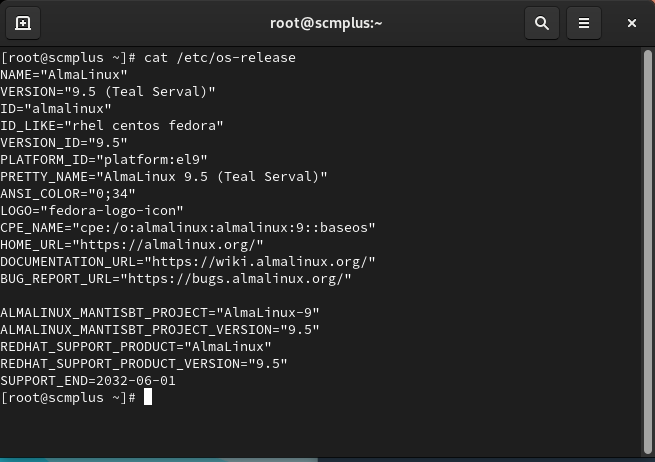
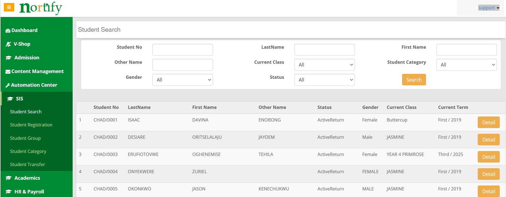
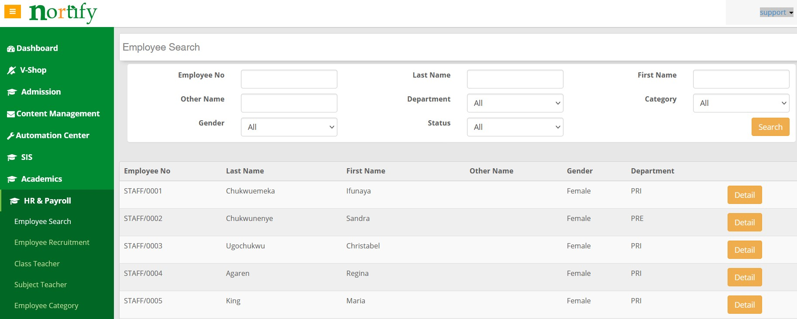

<!-- Section 1: Introduce Yourself -->

## ABOUT ME
Hello! I'm Lawrence Maduabuchi 👨‍💻, a passionate Software Engineer and ICT Consultant dedicated to building innovative, scalable, and efficient solutions. With a strong background in full-stack development, system integration, and cloud technologies, I help businesses and organizations leverage software to drive growth, optimize operations, and deliver exceptional user experiences.

<!-- Mention your top/relevant skills here - core and soft skills -->
## WHAT I DO
As a seasoned Software Engineer, I specialize in developing high-quality applications and providing strategic ICT consulting services.

✅ Software Development & Engineering
I design, develop, and deploy robust software solutions — from web applications to enterprise-grade systems — ensuring efficiency, scalability, and security.

✅ Cloud Solutions & Integration
I architect and integrate cloud-native applications using platforms like Microsoft Azure and AWS, helping businesses transition smoothly to the cloud.

✅ Systems Optimization & ICT Consulting
I analyze and optimize existing systems, automate processes, and deliver strategic ICT consulting to align technology with business goals.

✅ Training & Mentorship
I mentor aspiring developers and teams, helping them sharpen their technical skills and adopt best practices in modern software development.

<!-- Section 2: List 3-4 key projects -->
## MY PORTFOLIO
A snapshot of some projects I've been proud to contribute to.

Multi-Modal Transportation Network Simulation Using SUMO
Built a smart traffic simulation system using SUMO, Python, and XML to optimize transportation networks and minimize congestion in urban areas.

Residential Facility Checklist App (PowerApps & SharePoint)
Developed a low-code application for real-time residential suite management, streamlining inspections and reporting using Microsoft Power Platform.

Legacy System Deployment on AlmaLinux OS
Successfully migrated and deployed a legacy database-driven system on an on-premise AlmaLinux server, ensuring high availability and data integrity.
.png)

Document Management System Implementation (Microsoft 365 Ecosystem)
Led the design and partial implementation of a modern, secure document management system to digitize and manage records effectively for a corporate organization.

School Management Solution - Nortify
Nortify is a cloud-based, all‑in‑one School Management System (SMS) tailored for primary and secondary schools. It streamlines administration, communication, finance, academics, and data storage across phones, tablets, and PCs. It has modules such as Exams and Record, Smart Fee Manager, Student Information System, Smart Messaging, Smart Admission Engine

(More project details available upon request or via portfolio download.)

<!-- Contact Section -->
## CONTACT DETAILS
Let’s connect and create amazing things together!

<table> <tbody> <tr> <td>📧</td> <td><a href="mailto:madusquare@gmail.com">madusquare@gmail.com</a></td> </tr> <tr> <td>📞</td> <td>(+234) 806-548-4243</td> </tr> <tr> <td>📍</td> <td>Port Harcourt, Rivers State, Nigeria</td> </tr> <tr> <td>⬇️</td> <td><a href="LAWRENCE N MADUABUCHI.pdf">Download my CV</a></td> </tr> <tr> <td>🌐</td> <td><a href="https://www.linkedin.com/in/lawrence-maduabuchi/">Follow my journey on LinkedIn</a></td> </tr> <tr> <td>📺</td> <td><a href="https://www.youtube.com/">Watch my tutorials on YouTube</a></td> </tr> </tbody> </table>
